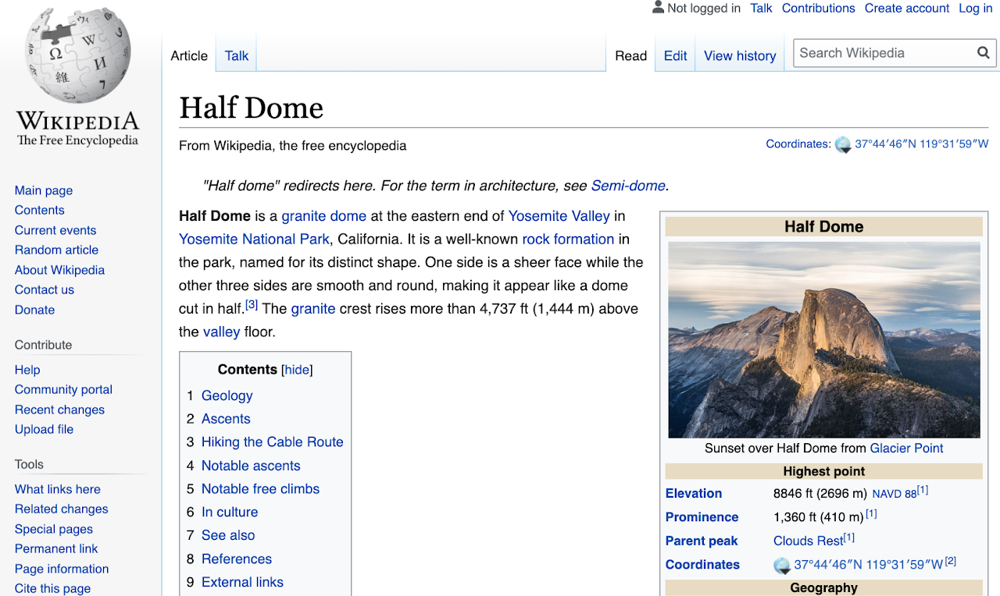

# WIT : Wikipedia-based Image Text Dataset

**Wikipedia-based Image Text (WIT) Dataset** is a large **multimodal
multilingual** dataset. WIT is composed of a curated set of 37.6 million entity
rich image-text examples with 11.5 million unique images across 108 Wikipedia
languages. Its size enables WIT to be used as a pretraining dataset for
multimodal machine learning models.

## Key Advantages

A few unique advantages of WIT:

-   The largest multimodal dataset (publicly available at the time of this writing) by the number of
    image-text examples.
-   A massively multilingual dataset (first of its kind) with coverage for over 100+
    languages.
-   A collection of diverse set of concepts and real world entities.
-   Brings forth challenging real-world test sets.

You can learn more about WIT Dataset from our
[arXiv paper](https://arxiv.org/abs/2103.01913).

Update (2021-04-14): Happy to share the good news that our paper got accepted at [SIGIR Conference](https://sigir.org/sigir2021/call-for-resource-papers/).

## WIT Example

## Wikipedia Page

For example, let's take the Wikipedia page for
[Half Dome, Yosemite in CA](https://en.wikipedia.org/wiki/Half_Dome).



[From the Wikipedia page for Half Dome : Photo by DAVID ILIFF. License: CC BY-SA 3.0](https://en.wikipedia.org/wiki/Half_Dome#/media/File:Half_Dome_from_Glacier_Point,_Yosemite_NP_-_Diliff.jpg)

## Wikipedia Page with Annotations of what we can extract

From this page, we highlight the various key pieces of data that we can
extract - images, their respective text snippets and some contextual metadata.


By extracting and filering these carefully, we get a clean high quality
image-text example that can be used in multimodal modeling.

<!--  -->

## Motivation

Multimodal visio-linguistic models rely on a rich dataset to help them learn to
model the relationship between images and texts. Having large image-text
datasets can significantly improve performance, as shown by recent works.
Furthermore the lack of language coverage in existing datasets (which are mostly
only in English) also impedes research in the multilingual multimodal space – we
consider this a lost opportunity given the potential shown in leveraging images
(as a language-agnostic medium) to help improve our multilingual textual
understanding.

To address these challenges and advance research on multilingual, multimodal
learning we created the Wikipedia-based Image Text (WIT) Dataset. WIT is created
by extracting multiple different texts associated with an image (e.g., as shown
in the above image) from Wikipedia articles and Wikimedia image links. This was
accompanied by rigorous filtering to only retain high quality image-text sets.

The resulting dataset contains over 37.6 million image-text sets – making WIT
the largest multimodal dataset (publicly available at the time of this writing) 
with unparalleled multilingual coverage – with 12K+ examples in each of 
108 languages (53 languages have 100K+ image-text pairs).

## WIT: Dataset Numbers

Type          | Train  | Val    | Test   | Total / Unique
------------- | ------ | ------ | ------ | --------------
Rows / Tuples | 37.13M | 261.8K | 210.7K | 37.6M
Unique Images | 11.4M  | 58K    | 57K    | 11.5M
Ref. Text     | 16.9M  | 150K   | 104K   | 17.2M / 16.7M
Attr. Text    | 34.8M  | 193K   | 200K   | 35.2M / 10.9M
Alt Text      | 5.3M   | 29K    | 29K    | 5.4M / 5.3M
Context Texts | -      | -      | -      | 119.8M

### WIT: Image-Text Stats by Language

Image-Text   | # Lang | Uniq. Images  | # Lang
------------ | ------ | ------------- | ------
total > 1M   | 9      | images > 1M   | 6
total > 500K | 10     | images > 500K | 12
total > 100K | 36     | images > 100K | 35
total > 50K  | 15     | images > 50K  | 17
total > 14K  | 38     | images > 13K  | 38

## Get WIT

We believe that such a powerful diverse dataset will aid researchers in building
better multimodal multilingual models and in identifying better learning and
representation techniques leading to improvement of Machine Learning models in
real-world tasks over visio-linguistic data.

WIT Dataset is now available for download. Please check the [data](DATA.md) page.

## Citing WIT

If you use the WIT dataset, you can cite our work as follows.

```bibtex
@article{srinivasan2021wit,
  title={WIT: Wikipedia-based Image Text Dataset for Multimodal Multilingual Machine Learning},
  author={Srinivasan, Krishna and Raman, Karthik and Chen, Jiecao and Bendersky, Michael and Najork, Marc},
  journal={arXiv preprint arXiv:2103.01913},
  year={2021}
}
```

## License

This data is available under the [Creative Commons Attribution-ShareAlike 3.0 Unported](LICENSE) license.

## Projects using WIT

For information regarding [MURAL](https://github.com/google-research-datasets/wit/tree/main/mural) (Multimodal, Multitask Retrieval Across Languages) paper accepted at EMNLP 2021.

## Contact

For any questions, please contact wit-dataset@google.com.

If WIT dataset is useful to you, please do write to us about it. Be it a blog post, a research project or a paper, we are delighted to learn about it.
